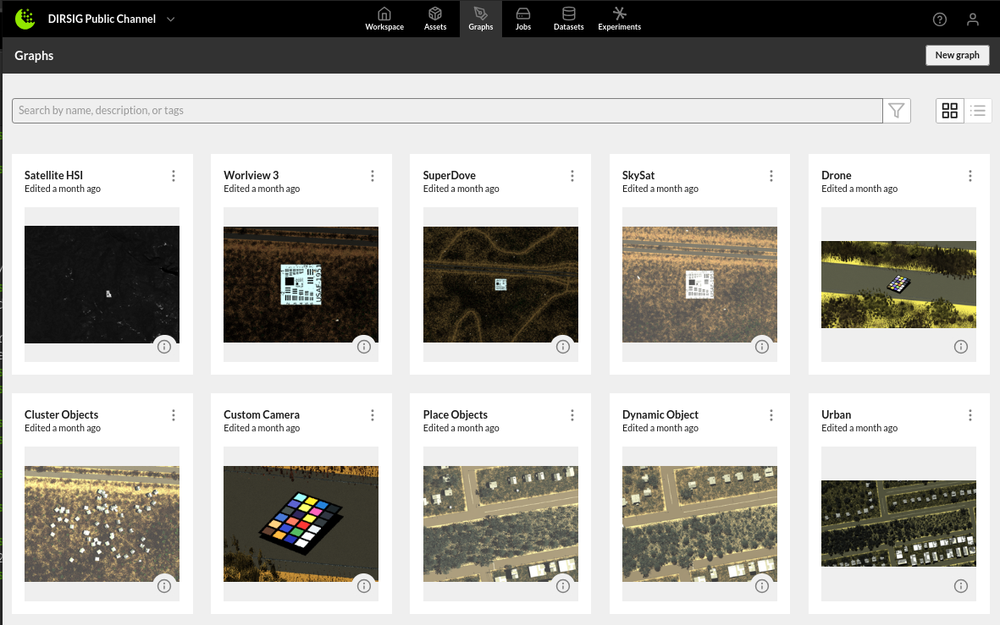
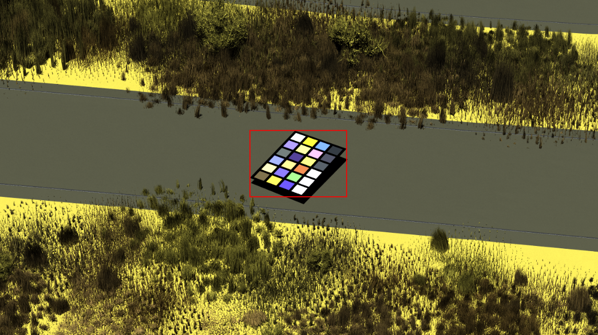

# DIRSIG Channel

This channel demonstrates how to use DIRSIG on the Rendered.ai (RAI) platform for generating synthetic data. A channel is what
we call a docker container configured to run on the RAI platform. It defines a specific set of nodes that can be combined
in our web-based graphical interface to generate variability within the synthetic data for a specific use case.

Some examples of how the nodes of this channel can be combined to configure DIRSIG simulations,
create a new workspace in your Rendered.ai account with the content code: *DIRSIGOPEN*.
The graphs, and associated datasets, are documented in the workspace.

 

## Examples

One of the sensors that has been defined in this channel is placed on a drone. Below is an image generated by the channel
of the Macbeth color chart placed on the ground. The bounding box is shown but pixel-level annotations are also available.

## Setup

First you'll need to clone this repository and inside the repository type the command `git submodule update --init` which will 
automatically clone the [DIRSIG File Maker](https://dirsig-gitlab.cis.rit.edu/dirsig_public/dirsig-file-maker.git) repository
which is a library built to make driving DIRSIG from Python easier. After cloning this repository, there are several steps 
required to start using this channel both locally and deployed on the RAI platform.

### Make a Rendered.ai account

Any user can get free access to the Rendered.ai platform by following this [link](https://rendered.ai/free-trial/). A user account 
is required to load the volume data associated with this channel and to deploy your own customized channel to the Rendered.ai 
platform.

### Download DIRSIG

DIRSIG5 is the simulator used to generate the synthetic data for this channel. If you have access to DIRSIG then download the
binaries and place the `bin/lib/lib64/plugins` directories inside a directory called `dirsig-bin` at the top-level of this
repository. If you don't have access, this [link](https://dirsig.cis.rit.edu/) will show you how to gain access.

### Start making data

* Start VScode and open the directory for this repository
    * If this is your first time running VScode the following extensions should be installed: Docker, Dev Containers
    * More detailed instructions are available [here](https://support.rendered.ai/development-guides/setting-up-the-development-environment)
* It should notice the Dev Container and ask to `Reopen in Container`, click that button
* Once the container has been built, you should have a prompt that looks like this `(anatools) anadev@[computer name]:/workspaces/dirsig-channel$`
* Mount the channel volume with this command `anamount --email [e-mail used to create free account]` and enter the password when asked for it
    * A `data/volumes` directory should appear, feel free to look around at the assets available
    * This process will continue until the user kills it with `Ctrl+c` create a new terminal for the next step
* To start making data type `ana --graph graphs/default.yml` and after a minute an `output` directory will appear
    * Once the simulation is complete, the `output` directory will contain all of the artifacts from the run
    * The default run number is 0 to make the next image in the series add `--interp_num 1` to the `ana` command
    * Changing the number passed to `--interp_num` iterates through the randomness defined by the graph

### Deploying your channel

Now that you've successfully run your channel locally and generated a few images, you may realize that it would be faster
to parallelize things so you can generate a lot of images a lot faster. This is where the Rendered.ai platform can help.
This [link](https://support.rendered.ai/development-guides/deploying-a-channel) provides more detail on the process but
the basics are also shown below.

* Run `anadeploy --email [e-mail used to create free account]` and enter the password when asked for it
* A prompt will display and you'll have the option to create a new channel by entering 0
* Then select your organization that comes with your free account and confirm the creation by typing `y`
* Then provide a name for your channel, if you don't enter anything it will use the default name
* At this point, the process is automated, once it finishes you'll see your new channel in your organization on the platform

## Additional Resources
[Ana Software Architecture](https://support.rendered.ai/development-guides/ana-software-architecture)  
[Managing Content with Package Volumes](https://support.rendered.ai/development-guides/ana-software-architecture/package-volumes)  
[Deploying a Channel](https://support.rendered.ai/development-guides/deploying-a-channel)  
[Toybox Examplel](https://support.rendered.ai/development-guides/an-example-channel-toybox/run-and-deploy-the-toybox-channel)  

## License

The source code and files in this repository are copyright 2019-2025 DADoES, Inc. and licensed under the Apache 2.0
license which is located at the root level of this repository: [LICENSE](LICENSE).

