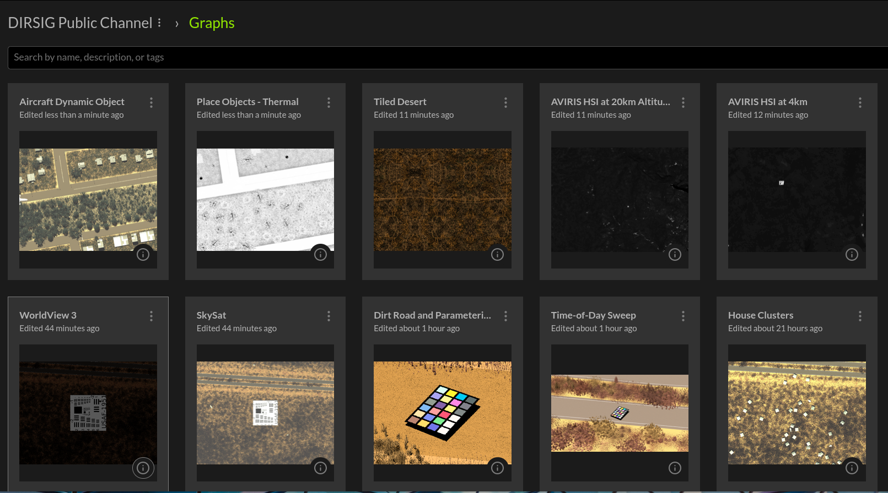
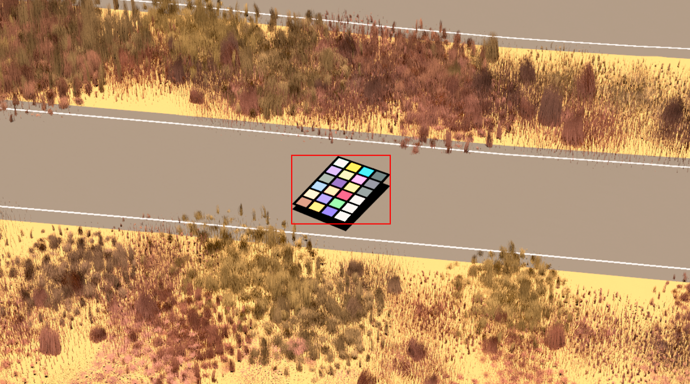

# DIRSIG Channel

This repository is a **starter channel** for the Rendered.ai (RAI) platform that drives [DIRSIG5](https://dirsig.cis.rit.edu/) — a physics-based radiometric image simulator — to generate synthetic remote sensing datasets. The channel is built on [DIRSIG File Maker (`dirfm`)](https://dirsig-gitlab.cis.rit.edu/dirsig_public/dirsig-file-maker.git), a Python library that procedurally generates the full set of DIRSIG configuration files from high-level node parameters, removing the need to write XML input files by hand.

For pre-built example graphs and datasets, create a new workspace in your Rendered.ai account with the content code: **DIRSIGOPEN**.



## How It Works: dirfm as the Config Generation Layer

Each simulation run begins when the `Simulate` node executes. Every node in the channel makes `dirfm` API calls that together construct the complete set of files DIRSIG5 needs — no hand-written XML required.

```
Graph nodes (Python)
      │
      ▼
 dirfm API calls                     Written to /tmp/dirsig_input/
 ─────────────────────────────────   ────────────────────────────────
 DIRSIG()          orchestrator  →   task.json, scene refs
 SCENE()           scene builder →   *.scene (XML)
 MasterMaterialList material DB  →   *.mml (XML)
 GlistBaseGeometry geometry      →   *.glist (XML)
 platform_sensor   sensor model  →   *.platform (XML)
 flexible_motion   trajectories  →   *.motion (XML)
 atmosphere/       env. physics  →   *.atm, *.wth
 ephemeris
      │
      ▼
 dirsig5 binary consumes /tmp/dirsig_input/  →  synthetic images + annotations
```

The `dirfm` submodule lives at `packages/dirfm/`. The channel-specific node logic lives at `packages/dirsig_pkg/dirsig_pkg/`. The mapping between them is:

| Channel module | dirfm module used | What it builds |
|---|---|---|
| `nodes/simulators.py` | `dirfm.dirsig.DIRSIG` | Top-level orchestrator; calls `add_scene()`, writes all files, invokes `dirsig5` |
| `nodes/backgrounds.py` | `dirfm.scene.SCENE`, `dirfm.glist` | Scene XML with terrain geometry, materials, and placed objects |
| `lib/materials_*.py` | `dirfm.materials`, `dirfm.utilities.material_manager.MasterMaterialList` | MML files mapping geometry material IDs to spectral reflectance/emittance data |
| `lib/camera.py` | `dirfm.platform_sensor` | Focal plane, instrument, and sensor attachment tree |
| `nodes/flex_motion.py` | `dirfm.flexible_motion` | Platform trajectory XML (waypoints, straight-line, fixed) |
| `nodes/ephemeris.py` | `dirfm.ephemeris` | Solar/lunar position (fixed angles or SPICE-based) |
| `nodes/simulators.py` | `dirfm.atmosphere` | Atmosphere and weather file references |
| `lib/object.py`, `nodes/objects.py` | `dirfm.glist` | Per-object geometry instances placed into the scene |

### Scene assembly example

A `Desert Highway` node calls `SCENE()` to create a scene object, attaches terrain geometry via `glist.GlistBaseGeometry()`, registers a `MasterMaterialList`, and returns a Python dict. The downstream `Simulate` node passes that dict to `dirsig.add_scene()` — which writes the `.scene` XML — then calls `dirsig.run()` which invokes `scene2hdf` and `dirsig5` as subprocesses.

For tiled scenes (e.g. `Scene Tiles: "9 (3x3)"`), the scene node returns a list of nine `SCENE` objects with metre-level `[x, y, z]` offsets. The `Simulate` node iterates `add_scene(scene, offset=offset)` for each tile, letting DIRSIG place the mosaic geometry automatically.

## Nodes and Graphs

### Node categories

| Category | What it configures in dirfm |
|---|---|
| **Scenes** → Backgrounds | `SCENE` + `glist` geometry + `MasterMaterialList` |
| **Scenes** → Object Inventory | `glist.GlistBaseGeometry` bundles (vehicles, structures, vegetation, targets) |
| **Scenes** → Object Modifiers | Transforms applied to `glist` instances before scene registration |
| **Platforms** → Sensors | `platform_sensor` focal plane + instrument definitions |
| **Motion** | `flexible_motion` location and orientation engine XML |
| **Simulators** → Ephemeris | `ephemeris` plugin selection and parameters |
| **Simulators** → DIRSIG | `DIRSIG` orchestrator — the graph's terminal execution node |

### Available scenes

| Scene | Size | Notes |
|---|---|---|
| Desert Highway | 6 km × 6 km per tile | Configurable road surface, vegetation; supports `Scene Tiles` input for 1, 3, or 9-tile mosaics covering up to 18 × 18 km |
| Urban (LWIR) | 3 km × 3 km | Full urban block layout; optimised for thermal IR simulation |
| Sierra Nevada | 150 km × 150 km | Low-resolution wide-area terrain |

### Example graphs

| Graph | Sensor | Scene | Purpose |
|---|---|---|---|
| `graphs/default.yml` | SuperDove (EO) | Desert Highway | Baseline EO collect |
| `graphs/Drone.yaml` | RGB drone | Desert Highway | Low-altitude nadir with Macbeth chart |
| `graphs/ClusterObjectsIR-clean.yml` | Thermal | Urban | Thermal IR with clustered objects |
| `graphs/dynamic.yml` | SuperDove | Desert Highway | Moving platform / dynamic objects |
| `graphs/tests/` | Various | Various | Per-sensor and per-feature smoke tests |

## Examples

Drone collect of a Macbeth colour chart at low altitude. Bounding-box and pixel-level annotations are generated automatically.



## Setup

Clone the repository then pull the `dirfm` submodule:

```bash
git clone <this-repo>
cd dirsig-channel
git submodule update --init
```

### Make a Rendered.ai account

Free access is available at [rendered.ai/free-trial](https://rendered.ai/free-trial/). An account is required to mount the volume data and to deploy the channel to the platform.

### Download DIRSIG

Download DIRSIG5 binaries from [dirsig.cis.rit.edu](https://dirsig.cis.rit.edu/) and place the `bin/`, `lib/`, `lib64/`, and `plugins/` directories inside a `dirsig-bin/` directory at the root of this repository.

### Start making data

* Open the repository in VSCode with the Docker and Dev Containers extensions installed.
* Click **Reopen in Container** when prompted. The prompt will look like: `(anatools) anadev@[host]:/workspaces/dirsig-channel$`
* Mount the channel volume (runs until killed with `Ctrl+C` — open a second terminal for the next steps):
  ```bash
  anamount --email <your-rendered.ai-email>
  ```
* Run a simulation locally:
  ```bash
  ana --graph graphs/default.yml
  ```
  Output images and annotations appear in `output/`. Increment `--interp_num` to step through the graph's randomisation:
  ```bash
  ana --graph graphs/default.yml --interp_num 1
  ```
* Run a preview (validates graph wiring and node execution without invoking `dirsig5`):
  ```bash
  ana --graph graphs/default.yml --preview
  ```

### Deploying your channel

```bash
anadeploy --email <your-rendered.ai-email>
```

Follow the interactive prompts to select your organisation and name the channel. Once deployed, the channel appears in your Rendered.ai organisation and jobs can be dispatched at scale. See [Deploying a Channel](https://support.rendered.ai/development-guides/deploying-a-channel) for full details.

## Repository Layout

```
packages/
  dirfm/              DIRSIG File Maker — Python API for DIRSIG config generation (submodule)
  dirsig_pkg/         Channel node implementations wrapping dirfm
    nodes/            Node classes (backgrounds, sensors, motion, simulators, objects…)
    lib/              Shared helpers (camera models, material definitions, object placement)
    platform/         Sensor spectral response files
graphs/               Example and test graphs (YAML)
docs/                 Channel documentation and screenshots
dirsig-channel.yml    Channel deployment manifest
```

## Additional Resources

[Ana Software Architecture](https://support.rendered.ai/development-guides/ana-software-architecture) <br />
[Managing Content with Package Volumes](https://support.rendered.ai/development-guides/ana-software-architecture/package-volumes) <br />
[Deploying a Channel](https://support.rendered.ai/development-guides/deploying-a-channel) <br />
[Toybox Example Channel](https://support.rendered.ai/development-guides/an-example-channel-toybox/run-and-deploy-the-toybox-channel) <br />
[DIRSIG Documentation](https://dirsig.cis.rit.edu/docs/new/index.html) <br />
[DIRSIG File Maker (dirfm)](https://dirsig-gitlab.cis.rit.edu/dirsig_public/dirsig-file-maker.git) <br />

## License

The source code and files in this repository are copyright 2019-2026 DADoES, Inc. and licensed under the Apache 2.0 license: [LICENSE](LICENSE).

