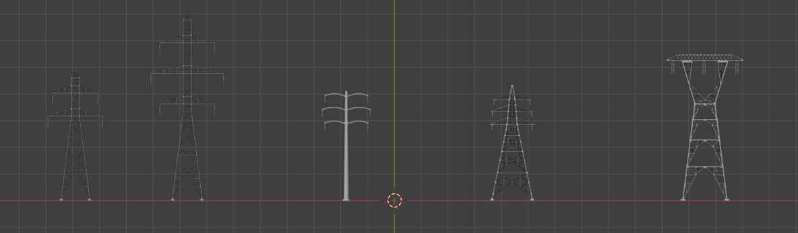

# Countryside

High resolution European countryside scene 7km x 7km.

Spectral coverage: visible through NIR (0.35–1.4 µm).

Elevation 258 m to 388 m across interior towers and surrounding terrain.

Geodetic location is (44.685 deg, 10.2172 deg, 0 m).

Includes power transmission infrastructure with fixed tower locations and catenary cables.

Vegetation regions (Central/Northern/Eastern/Southern/Western) selectable per region: Grass, Wheat, Corn, Desert.

Road networks included as decal maps.

The schematic illustrates the scene boundary (green), transmission corridors (red), and tower/cable placements (star markers along the corridors). Use it to visually correlate corridor groups with parcel regions and to plan sensor viewpoints along spans.

## Parameters

- **Objects**
  - Optional list of object files/generators to insert into the scene.
  - Static instances are aligned to terrain elevation and slope when applicable.

- **Tower Type**
  - Select one of: "Tower 1"–"Tower 5" or "<random>".
  - Determines the tower bundle and locator positions used for cable attachment.
  - See visual reference: 

- **Cable Type**
  - Select one of: "Aluminum" or "Copper" ("<random>" supported by UI but code paths are deterministic for listed values).
  - Controls BRDF/material used for cable rendering.

- **Central/Northern/Eastern/Southern/Western Region**
  - These are input ports that accept links from biome nodes (`GrassBiome`, `WheatBiome`, `CornBiome`, `DesertBiome`).
  - **Unlinked Behavior:** If a region port is left unlinked, it will default to the "Desert" biome.
  - **Linked Behavior:** If one or more biome nodes are linked to a region, one of the linked biomes will be chosen at random for each execution of the graph. This allows for dynamic and varied scene generation.

- **Use Trees**
  - Select "True" or "False" to control whether trees are added to the scene.

## Biome Nodes

The Countryside scene uses biome nodes to define vegetation patterns in different regions. Each biome node provides configuration for bundle objects, dimensions, spacing, and distribution patterns.

### Grass Biome
- **Bundle**: `grass/grass.glist`
- **Dimensions**: 400m x 400m patches
- **Density Parameter**: Controls grass distribution pattern
  - **Lush & Thick** - Dense grass coverage with 1.5m spacing and 0.75m deviation
  - **Thin & Clumpy** - Sparse, clumpy grass with 3.0m spacing and 1.5m deviation
  - **<random>** - Randomly selects between Lush & Thick and Thin & Clumpy for each execution

### Wheat Biome
- **Bundle**: `wheat/wheat.glist`
- **Dimensions**: 1000m x 1000m patches
- **Spacing**: 0.5m between plants
- **Deviation**: 0.3m distribution variance
- Represents agricultural wheat fields with dense, organized planting

### Corn Biome
- **Bundle**: `corn/corn.glist`
- **Dimensions**: 1500m x 400m patches (optimized for row planting)
- **Spacing**: 0.30m between planted rows, 0.75m between rows
- **Deviation**: 0.1m distribution variance
- Represents agricultural corn fields with characteristic row structure

### Desert Biome
- **Bundle**: `Euclea_racemosa/Euclea_racemosa.glist` and `Restio_eleocharis/Restio_eleocharis.glist`
- **Dimensions**: 70m x 70m patches
- **Spacing**: 10m between plants
- **Deviation**: 5m distribution variance
- Sparse vegetation typical of desert/arid environments

## Notes

- Towers and cable spans use fixed coordinates from CSVs under `towerdata/positions_towerGroup*.csv` packaged with the scene.
- Roads are applied as decal maps to the terrain.
